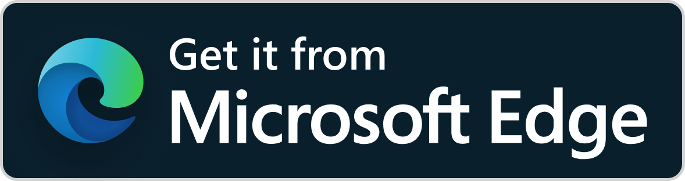

# Immich Bridge


[](https://github.com/Peaj/immich-bridge/releases/latest)
[](LICENSE)
[](https://github.com/Peaj/immich-bridge/commits/main)
[](https://github.com/Peaj/immich-bridge/actions/workflows/ci.yml)

Immich Bridge is a small Windows helper that adds workstation-native actions to Immich assets. Browser extensions add buttons to Immich, and a local .NET helper handles `immich-bridge://` protocol links by mapping Immich server paths to local Windows paths. A Tampermonkey userscript remains available as a fallback for unsupported browsers.

## Features

- Reveal the mapped local file in Windows Explorer.
- Open the mapped local file with Windows' native Open With dialog.
- Open directly in a configured desktop app such as Photoshop when an app id is supplied.
- Register and unregister the `immich-bridge://` URL protocol under `HKEY_CURRENT_USER`.
- Run protocol actions without opening a console window.
- Load JSON config from `%AppData%\ImmichBridge\config.json`.
- Reject unmapped paths and unknown app ids.
- Log errors to `%AppData%\ImmichBridge\logs\helper.log`.

> [!NOTE]
> AI assistance was used during development of this project. Code, design, and release decisions remain reviewed and maintained by the project author.

## Install

Download `ImmichBridge-win-x64-vX.Y.Z.zip` from GitHub Releases, extract it to a stable folder, and run `ImmichBridge.exe`.

On first launch, Immich Bridge opens a setup wizard that:

- creates `%AppData%\ImmichBridge\config.json`;
- asks for the Immich remote path prefix, for example `/external/fotos`;
- lets you choose the matching local Windows folder, for example `M:\Fotos`;
- optionally validates a sample Immich asset path;
- registers `immich-bridge://` under `HKEY_CURRENT_USER`;
- points you to the browser add-ons, with the Tampermonkey userscript as a fallback.

No admin rights are required for protocol registration.

### Browser Add-ons

Click your browser to install the add-on:

<p>
  <a href="https://chromewebstore.google.com/detail/ohghjemcjnaickehejdokfmjphpjoiag"></a>
  <a href="https://microsoftedge.microsoft.com/addons/detail/immich-bridge/bgipocndkokcllfjgmiicakhlbddnjij"></a>
  <a href="https://addons.mozilla.org/en-US/firefox/addon/immich-bridge/"></a>
</p>

After installing, open the Immich Bridge extension options page, enter your Immich base URL, and grant access for that site. The extension stores only that local browser setting and injects the toolbar button only on the configured Immich origin.

## Configure

Normal users should use the first-run wizard instead of editing JSON manually. Rerun setup at any time:

```powershell
.\ImmichBridge.exe --setup
```

The internal config file is stored at `%AppData%\ImmichBridge\config.json`:

```json
{
  "Mappings": [
    {
      "RemotePrefix": "/mnt/immich-external/photos",
      "LocalPrefix": "Z:\\Photos"
    }
  ],
  "Apps": {
    "photoshop": {
      "ExecutablePath": "C:\\Program Files\\Adobe\\Adobe Photoshop 2025\\Photoshop.exe",
      "Arguments": "\"{file}\""
    }
  },
  "Options": {
    "ConfirmBeforeOpeningApps": false,
    "VerifyLocalFileExists": true,
    "LogFile": "%AppData%\\ImmichBridge\\logs\\helper.log"
  }
}
```

## Usage

Register the protocol handler:

```powershell
dotnet run --project .\src\ImmichBridge -- --register-protocol
```

Run the setup wizard:

```powershell
dotnet run --project .\src\ImmichBridge -- --setup
```

Check config, mappings, protocol registration, and log path:

```powershell
dotnet run --project .\src\ImmichBridge -- --check
```

Validate path mapping without launching anything:

```powershell
dotnet run --project .\src\ImmichBridge -- --map-path "/mnt/immich-external/photos/2024/img.jpg"
```

Test the Windows Open With dialog from the terminal:

```powershell
dotnet run --project .\src\ImmichBridge -- --open-with "/mnt/immich-external/photos/2024/img.jpg"
```

This uses Windows' `SHOpenWithDialog` shell API. If the file type already has a default app, Windows may show a compact chooser or launch the selected app after confirmation depending on your system settings.

When testing protocol launches, inspect the helper log:

```powershell
Get-Content "$env:APPDATA\ImmichBridge\logs\helper.log" -Tail 80 -Wait
```

Manual protocol tests:

```text
immich-bridge://reveal?path=%2Fmnt%2Fimmich-external%2Fphotos%2F2024%2Fimg.jpg
immich-bridge://open?path=%2Fmnt%2Fimmich-external%2Fphotos%2F2024%2Fimg.jpg
immich-bridge://open?app=photoshop&path=%2Fmnt%2Fimmich-external%2Fphotos%2F2024%2Fimg.jpg
```

For unsupported browsers, store-review delays, or users who prefer Tampermonkey, install `userscript/immich-bridge.user.js` in Tampermonkey. You can use the copy bundled in the release ZIP, the `.user.js` release asset, or the latest script directly from GitHub:

```text
https://raw.githubusercontent.com/Peaj/immich-bridge/main/userscript/immich-bridge.user.js
```

On Immich asset detail pages, the browser integration injects an Immich Bridge icon into the asset toolbar, opens a small action menu, calls `GET /api/assets/{id}` with the current browser session, reads `originalPath`, and launches `immich-bridge://` URLs. The default `Open with...` action uses Windows' native app picker, so it does not need app ids hardcoded in the browser extension or userscript.

## Build and Test

```powershell
dotnet build .\ImmichBridge.slnx
dotnet test .\ImmichBridge.slnx
npm run check:extension
npm run lint:extension
npm run build:extensions
```

## Releases

Immich Bridge uses semantic versioning and GitHub Releases. Release tags use `vX.Y.Z`; the release workflow verifies that the tag, app version, userscript version, Firefox extension version, and Chromium-family extension version match. See `docs/release.md` for the release process.

## Security Model

Immich Bridge never accepts executable paths or shell arguments from the URL. URLs can only name an action, an optional configured app id, and an Immich path. Paths must match a configured mapping, and the mapped local file must exist by default before anything is launched.

## Privacy

See [PRIVACY.md](PRIVACY.md).
